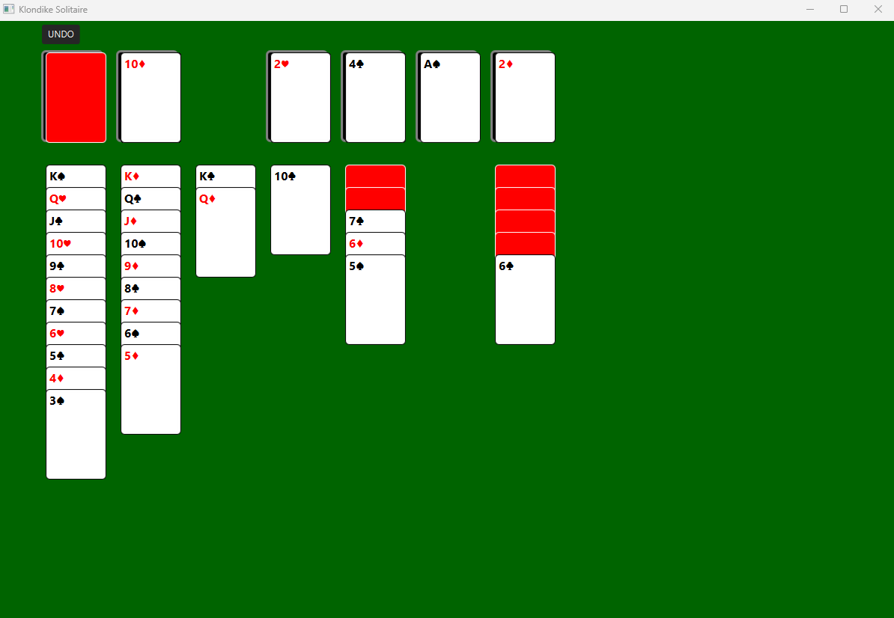

# Klondike Solitaire (Java)
Play the most raw form of Klondike Solitaire, playing from the **console**. 
See *How to Run from the Console* section to play from terminal. 

Currently constructing UI for the game using JavaFX to expand the project. 

## How to Run from the **Console**

1. **Clone the repository**
   ```bash
   git clone https://github.com/LincolnKoskela/Klondike.git
   ```

2. **Open the project in VS Code or any IDE**

3. **Compile all `.java` files**
   ```bash
   javac src/main/java/klondike/*.java
   ```

4. **Run the game**
   ```bash
   java -cp src/main/java klondike.Play
   ```


## Current State of Game
- Fully playable from **console**
- Fully playable UI Version

## Project Expansion Focus
- 1) Add animations
- 2) Detech Wins
- 3) Timer on screen
- 4) Side Menu leading to other pages within the application
- 5) Other minor tweaks such as board layout adjustments, card visuals, backgrounds




## Features
- Object Oriented Design
- Complete Game Logic
- Player Perspective Rendering
- Timer Function
- Undo Functionality 
- Graphic Interface Design (JavaFX)

## klondike Architecture
| **Components** | **Responsibility** |
|----------------|--------------------|
| **Card** | Represents a single playing card (Rank, Suit, and face-up/face-down state). |
| **Pile (Interface)** | Defines common pile operations (`push`, `draw/pop`, `canAccept`, `size`, `clear`). |
| **Stock** | Manages the draw pile (face-down cards, handles recycling). |
| **Waste** | Holds drawn cards (face-up). |
| **Foundation** | Builds up cards by suit from Ace to King. |
| **Tableau** | Manages seven columns where cards build down in alternating color. |
| **Board** | Holds all piles, manages layout, and provides getters and clear/reset functions. |
| **GameEngine** | Controls rules, moves, validations, and overall game progression (`initial deal`, `move`, `checkWin`). |
| **Deck** | Creates and shuffles a standard 52-card deck. |
| **Play** | User plays the game, it's the intermediary between gameengine and player.
| **Command (Interface)** | Allows maps to associate keyboard input with `GameEngine` action. | 
| **Time** | Counts the start and end time in seconds or minutes. |
| **GameState** | Represents a frozen snapshot of the current game in action. | 
| **Snapshot** | Creates a `GameState` of deep copies each piles `copy()` function. |
| **InputController** | Input command mapping: Maps keys to `Command` actions. |
| **TextViews** | Displays text throughout the game and menus. |

## klondike GUI Architecture (JavaFX)
| **Components** | **Responsibility** |
|----------------|--------------------|
| **BoardView** | Visual layout of a klondike board using `PileViews`, `GameEngine`, and `Board` |
| **CardSlot** | Empty slot of CardView |
| **CardView** | Visual representation of a playing card (`Card`) |
| **FoundationView** | Extends `PileView` |
| **GameApp** | Runs game application |
| **PileCell** | StackPane layering `CardSlot` and `PileView` |
| **PileView** | Visually displays a pile of `CardViews` |
| **StockView** | Extends `PileView` |
| **TableauView** | Extends `PileView` |
| **UiMetrics** | Static variables used for consistency while constructing UI nodes and board layout | 
| **WasteView** | Extends `PileView` |

## Future Roadmap
| **Milestone** | **Description** |
|----------------|--------------------|
| **GameEngine completion** | Full movement management, stock/waste, foudations, and tableau's in fluidity. **Finished 24NOV25** |
| **Interactive terminal UI** | Add input commands for moves |
| **Graphic interface** | Implement a GUI version. JavaFX, then JS/web, or Figma | 

## Tech
- Langauge: Java
- IDE: VS CODE
- Version Control: Git & Github

## History Progress Log (Project Commenced 16 Sept 2025)

### (Oct 20-26, 2025) **started tracking**

- Finished `recycle()` function added a while loop to push cards onto stock until waste is empty 
- Created `Play.java` to start thinking about how Play will interact with `GameEngine`
- Edited what was `topCard()` in tableau class to be called `head()` and added `topCard()` 
function to return the first card in a tab. 
- Finished `canMove()` function which validates moving cards from one tableau to another
- Added `remove(card)` function to Tableau class to be able to remove card from column without
returning a value, like the `draw()` function

### (Oct 26-Nov 02, 2025)
- Added unshuffled deck overload along with gameengine overload to use unshuffled 
decks for more efficient testing. 
- Edited Deck constructor to give the option to shuffle or not, and edited `GameEngine` constructor 
to follow similar structure. This helps with testing out functions
- Added move functions for each pile ex) `moveFoundationToTableau(Card.Suit suit, int dest)`
- Added `remove` function `Foundation.java` and `Waste.java`
- Added `sublist` function to `Tableau.java` for moving sublist around within tabs.
- Added static helper function in board class to format the display better
- Added a players `draw()` function, Stock -> Waste from waste, play the card
- Fixed alignment on `Board.java`
- Fully functional GameEngine complete.

### (Nov 03 - 09, 2025)
- Constructing user inputs
- Game is playable. Still finding little bugs while testing game out. 
- Added Command Interface to use maps instead of if's. This allows associating
keys with actions. Such as 'x' -> game.draw() inside a map.
- testing and more testing

### (Nov 10 - 16, 2025)
- Added try catch blocks in the asking functions in `Play.java` to validate 
users enter columns within range and don't enter input mismatches 
ex) entering number when asking for foundation. 
- Added Timer functionality with `Time.java`.
- `isGameWon()` tracks tableau's instead of foundations.
- Added `getCards()` functions to each pile class. Returns type list. 
Will be used for creating snapshots for undo function.

### (Nov 17 - 23, 2025)
- Created `GameState.java` to represent a frozen snapshot of the current state 
of the game. 
- Added Copy Constructor in `Card` class.
- Added `copy()` functions to each pile class do perform a deep copy of the list, using 
`Card` copy construtor
- Created `Snapshot.java` to create a `snapshot` of the GameState.
- Created `undo()` functionality in the `GameEngine`. (Debugging)
- Added `InputController.java` to command controller inputs using map and `execute` function.
- Added `TextViews.java` class break up menus and displays throughout the game.
- Breaking up `Play.java` class so its not so cluttered. 

### (Nov 24 - 30, 2025)
- **Completed console version with updated undo, timer, and move count functions.**
- Created `GameApp.java` as main GUI
- Created `CardSlot.java` which is a StackPane representing open card slot and where
cards will go. 
- `CardView.java` is the image visual of my cards with `updateAppearance()` function, 
passing a card object in the constructor, giving it size as well.
- Added a gameengine to the `GameApp` to interact with the board constructing the 
stock, waste, foundations, and tableau rows and dealing a new game, `dealNewGame()`
- Added Clicking ability in `CardView` and `GameApp`.
- Can now click `Stock` to `Waste`. 

### (Dec 1 - 7, 2025)
- Click Waste to select waste, click on destination tableau to add selected card to destination tab.
- Added `GameEngine` field to `GameApp` to use engines moves instead of hardcode.
- Built Tableau -> Tableau move functionality, next is Foundations
- Moved Card labels to topLeft for better visability in tableau stacks.
- Added highlight functionality to selecting and deselecting a tableau card.
- Cards can now move to Foundation piles.

### (Dec 8 - 14, 2025)
- Added background slots to the foundations using `CardSlot` with a Stackpane(slot, `PileView`),
then used the StackPane as the clicker (named `foundationContainer`)
- Implemented `recycle()` to the game on the stockView clicker by checking if stock is not empty, 
clicking will draw card, else recycle, then `redraw()` the pileView
- Made into Maven Project -> added `pom.xml`  
- Implemented Undo button
- Sandboxing the project to explore around in javaFx and learn more. Running into some walls.

### (Dec 15 - 28, 2025)
- Sandbox learning

### (Dec 29, 2025 - Jan 19, 2026) 
- Starting over (x3) 
- Created scene, stage in `GameApp` `start(...)` function
- CardSlot layout
- Cardview layout 
- Debugged `Label` leaving the `CardView` and `CardSlot` due to not setting
max and min sizes on the `StackPane`
- `UiMetrics` class for consistency
- A lot of progress this week was review so got a lot done
- `PileView` is an abstract class that subclasses will extend, such as `TableauView`
- Created `TableauView` and `FoundationView` extending off `PileView`
- Created `StockView` and `WasteView` extending off `PileView`
- Created `BoardView` using the pileviews and `UiMetrics` for custom layout
- Stock to Waste clickable
- Play from Waste to Tableau
- Play from Tableau to Waste by a **single click**
- Yes empty Tableau columns are clickable
- Scrapping waste selection handlers and working on making each click, a single click move
- Might be tough for tableaus, may need source clicks and destination clicks for tab to tab moves
- Added Highlights around selections
- Tab -> Tab `engine` moves function properly using selections
- Foundation -> Tableau on single click
- Tab -> Tab works with single click feature for the foundation moves
- Full Game Playable! **18JAN26** (w/ undo feature)

### (Jan 20, 2026 - Current) -> Focusing on Animations
- Added `getTopCardView()` in `PileView` -> Animation helper function
- Added `popTopCardView()` in `PileView` -> Animation helper function
- Added `pushCardView(CardView cv)` in `PileView` -> Animation helper function