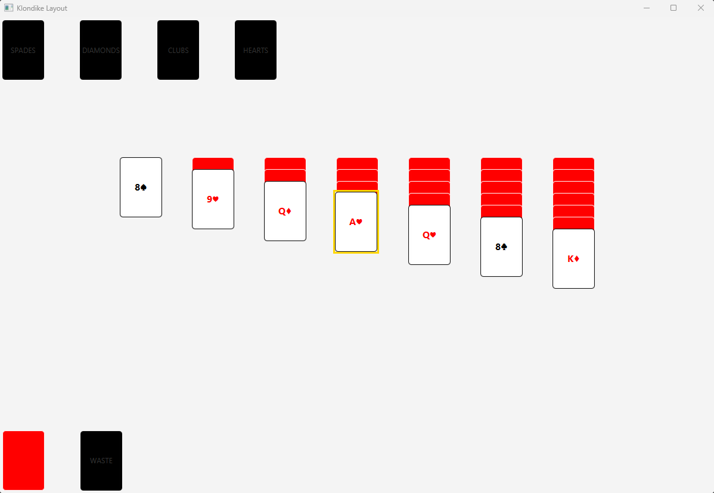

# Klondike Solitaire (Java)
Test your strategy and attention to detail playing the most raw, logic driven Klondike experience. 
This project is playable from **console**. 

## How to Run from the **Console**

1. **Clone the repository**
   ```bash
   git clone https://github.com/LincolnKoskela/Klondike.git
   ```

2. **Open the project in VS Code or any IDE**

3. **Compile all `.java` files**
   ```bash
   javac src/main/java/klondike/*.java
   ```

4. **Run the game**
   ```bash
   java -cp src/main/java klondike.Play
   ```


## Current State of Game
- Playable from **console**
- Making GUI using JavaFX
- Working through bugs moving cards around in the tableau piles




## Project Management
You can view my Agile board and current development progress here:

[Klondike Agile Board](https://github.com/users/LincolnKoskela/projects/1)

## Features
- Object Oriented Design
Clear seperation of responsibilities across classes and interfaces
- Complete Game Logic
Implements Solitaire's core rules: alternating colors, descending order, foundation suit stacking,
and stock/waste recycling
- Player Perspective Rendering
Each pile supports `toDisplay()` method for player facing views (showing only visible cards)
- Debug friendly
Each object has a `toString()` output for testing and debugging the internal state
- `Timer` 
To count the time it took to beat the game.
- Undo functionality 

## klondike Architecture
| **Components** | **Responsibility** |
|----------------|--------------------|
| **Card** | Represents a single playing card (Rank, Suit, and face-up/face-down state). |
| **Pile (Interface)** | Defines common pile operations (`push`, `draw/pop`, `canAccept`, `size`, `clear`). |
| **Stock** | Manages the draw pile (face-down cards, handles recycling). |
| **Waste** | Holds drawn cards (face-up). |
| **Foundation** | Builds up cards by suit from Ace to King. |
| **Tableau** | Manages seven columns where cards build down in alternating color. |
| **Board** | Holds all piles, manages layout, and provides getters and clear/reset functions. |
| **GameEngine** | Controls rules, moves, validations, and overall game progression (`initial deal`, `move`, `checkWin`). |
| **Deck** | Creates and shuffles a standard 52-card deck. |
| **Play** | User plays the game, it's the intermediary between gameengine and player.
| **Command (Interface)** | Allows maps to associate keyboard input with `GameEngine` action. | 
| **Time** | Counts the start and end time in seconds or minutes. |
| **GameState** | Represents a frozen snapshot of the current game in action. | 
| **Snapshot** | Creates a `GameState` of deep copies each piles `copy()` function. |
| **InputController** | Input command mapping: Maps keys to command actions. |
| **TextViews** | Displays text throughout the game and menus. |

## klondike GUI Architecture (JavaFX)
| **Components** | **Responsibility** |
|----------------|--------------------|
| **GameApp** | JavaFX GUI. |
| **CardSlot** | Represents a slot where playing cards will go. |
| **CardView** | Visual representation of a playing card. |
| **PileView** | Represents a pile of card objects. |

## Future Roadmap
| **Milestone** | **Description** |
|----------------|--------------------|
| **GameEngine completion** | Full movement management, stock/waste, foudations, and tableau's in fluidity. |
| **Interactive terminal UI** | Add input commands for moves |
| **Graphic interface** | Implement a GUI version. JavaFX, then JS/web | 
| **Save/load system** | Save game state and resume for later. |
| **Make CPU strategies** | Make AI's to revert to specific strategies (ex. always select from tab before stock) |
| **Statistical Analysis** | (ex. when x card is played, outcomes of winning changes) |

## Tech
- Langauge: Java
- IDE: VS CODE
- Version Control: Git & Github

## History Progress Log

### This Week: (Dec 1 - 7, 2025)
- Click Waste to select waste, click on destination tableau to add selected card to destination tab.
- Added `GameEngine` field to use engines move functions.

### (Nov 24 - 30, 2025)
- Completed console version with updated undo, timer, and move count functions.
- Created `GameApp.java` as main GUI
- Created `CardSlot.java` which is a StackPane representing open card slot and where
cards will go. 
- `CardView.java` is the image visual of my cards with `updateAppearance()` function, 
passing a card object in the constructor, giving it size as well.
- Added a gameengine to the `GameApp` to interact with the board constructing the 
stock, waste, foundations, and tableau rows and dealing a new game, `dealNewGame()`
- Added Clicking ability in `CardView` and `GameApp`.
- Can now click `Stock` to `Waste`. 

### (Nov 17 - 23, 2025)
- Created `GameState.java` to represent a frozen snapshot of the current state 
of the game. 
- Added Copy Constructor in `Card` class.
- Added `copy()` functions to each pile class do perform a deep copy of the list, using 
`Card` copy construtor
- Created `Snapshot.java` to create a `snapshot` of the GameState.
- Created `undo()` functionality in the `GameEngine`. (Debugging)
- Added `InputController.java` to command controller inputs using map and `execute` function.
- Added `TextViews.java` class break up menus and displays throughout the game.
- Breaking up `Play.java` class so its not so cluttered. 

### (Nov 10 - 16, 2025)
- Added try catch blocks in the asking functions in `Play.java` to validate 
users enter columns within range and don't enter input mismatches 
ex) entering number when asking for foundation. 
- Added Timer functionality with `Time.java`.
- `isGameWon()` tracks tableau's instead of foundations.
- Added `getCards()` functions to each pile class. Returns type list. 
Will be used for creating snapshots for undo function.

### (Nov 03 - 09, 2025)
- Constructing user inputs
- Game is playable. Still finding little bugs while testing game out. 
- Added Command Interface to use maps instead of if's. This allows associating
keys with actions. Such as 'x' -> game.draw() inside a map.
- testing and more testing

### (Oct 26-Nov 02, 2025)
- Added unshuffled deck overload along with gameengine overload to use unshuffled 
decks for more efficient testing. 
- Edited Deck constructor to give the option to shuffle or not, and edited `GameEngine` constructor 
to follow similar structure. This helps with testing out functions
- Added move functions for each pile ex) `moveFoundationToTableau(Card.Suit suit, int dest)`
- Added `remove` function `Foundation.java` and `Waste.java`
- Added `sublist` function to `Tableau.java` for moving sublist around within tabs.
- Added static helper function in board class to format the display better
- Added a players `draw()` function, Stock -> Waste from waste, play the card
- Fixed alignment on `Board.java`
- Fully functional GameEngine complete.

### (Oct 20-26, 2025) **started tracking**

- Finished `recycle()` function added a while loop to push cards onto stock until waste is empty 
- Created `Play.java` to start thinking about how Play will interact with `GameEngine`
- Edited what was `topCard()` in tableau class to be called `head()` and added `topCard()` 
function to return the first card in a tab. 
- Finished `canMove()` function which validates moving cards from one tableau to another
- Added `remove(card)` function to Tableau class to be able to remove card from column without
returning a value, like the `draw()` function

